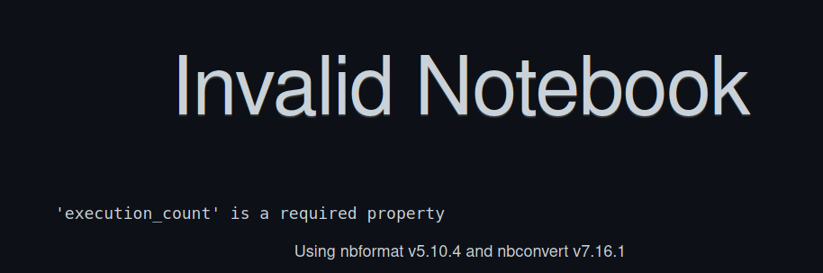

# Invalid-Notebook-Solver
Invalid-Notebook-Solver is a Python tool designed to clean and rebuild Jupyter notebooks to ensure they are valid for platforms like GitHub. This tool addresses common issues with notebook compatibility and provides functionalities to add new code and markdown cells, and to save and rebuild notebooks while preserving cell outputs.


## Features
- Open and Load Notebooks: Load Jupyter notebooks from a specified file path.
- Add Code Cells: Add new code cells with specified content to the notebook.
- Add Markdown Cells: Add new markdown cells with specified content to the notebook.
- Save Notebooks: Save the current state of the notebook to a specified file path.
- Rebuild Notebooks: Rebuild notebooks to ensure all cells and outputs are correctly formatted and compatible with GitHub.

## Usage
```python
from notebook_editor import NotebookEditor

# Initialize notebook editor with original notebook path
nb_editor = NotebookEditor(file_path="path/to/original_notebook.ipynb")

# Add a code cell
nb_editor.add_cell_code(content="print('This is a new code cell.')")

# Add a markdown cell
nb_editor.add_cell_markdown(content="This is a new markdown cell.")

# Save the modified notebook
nb_editor.save_notebook()

# Rebuild the notebook in a valid format for GitHub
nb_editor.rebuild_notebook(new_file_path="path/to/rebuilt_notebook.ipynb")
```

## Installation
```bash
git clone git@github.com:ValentinLibouton/Invalid-Notebook-Solver.git
cd Invalid-Notebook-Solver
pip install -r requirements.txt
```

## Requirements
- nbformat

## License
This project is licensed under the MIT License.